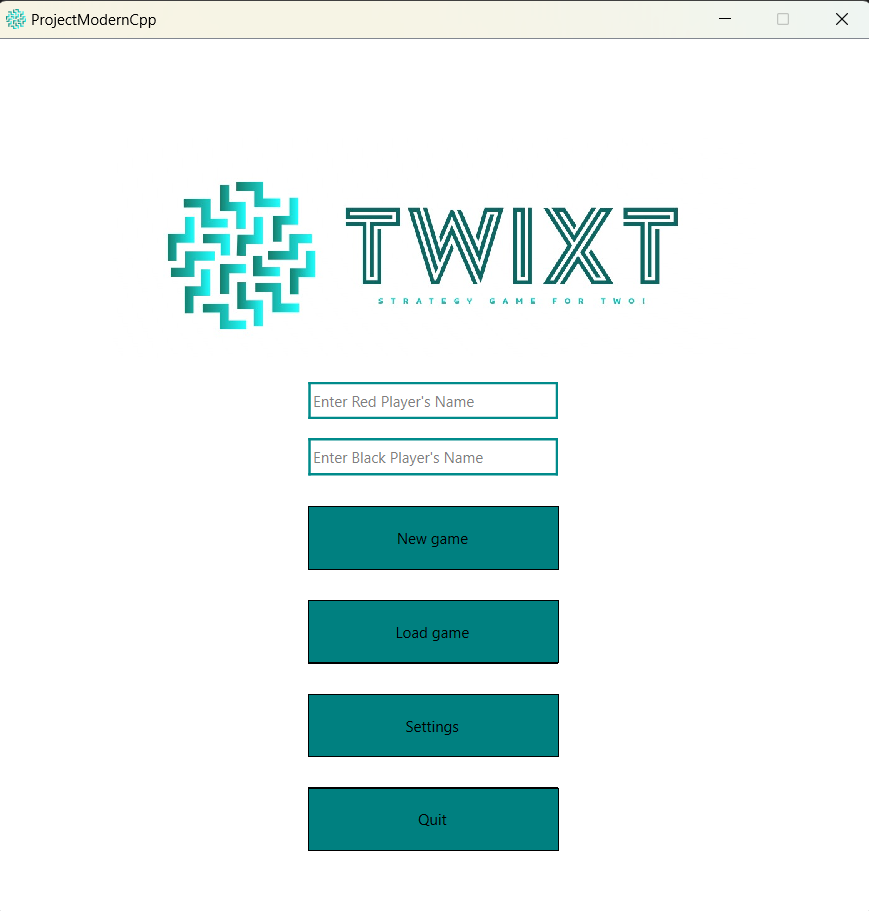
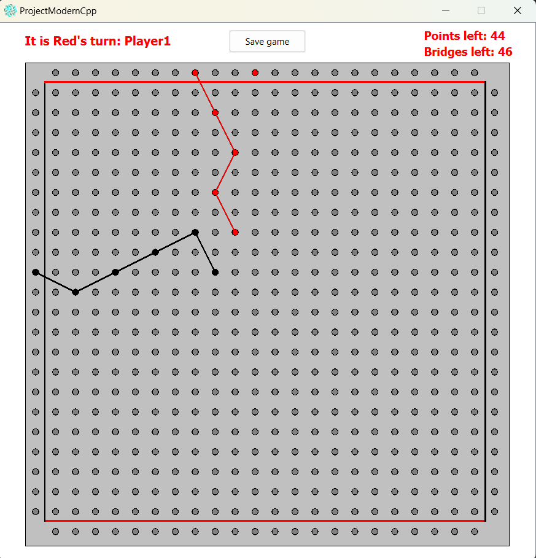
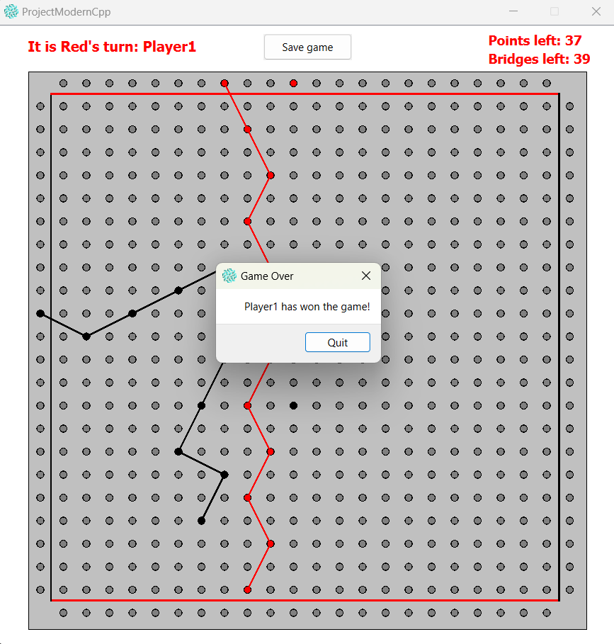

# Twixt - Strategy Game for Two

## "Hugs for Bugs" Team Members
- Marin Alexandra
- Mihai Luciana
- Necula Luana
- Popica Stefania

## Requirements
- Qt 
     - version: `6.5.3`
     - `Qt Debug Information Files`
- VS Extension: `Qt Visual Studio Tools`

## Installation Steps
1. In Visual Studio, navigate to `Extensions > Manage Extensions`.
2. Search and install the `Qt Visual Studio Tools` extension.
3. Restart Visual Studio when prompted.
4. After restarting, a popup will ask to choose the Qt version. If missed, go to `Extensions > Qt VS Tools > Qt Versions`.
5. Click `+`, navigate to the Qt installation folder (e.g., `Qt > 6.5.3 > msvc2019_64 > bin`), and select `qmake.exe`.

## Twixt - Basic Rules
Twixt is a two-player strategy game. The goal is to connect two bases with an unbroken line of bridges. The first player to do this wins.

### Introduction
Basic Rules: [Twixt BoardSpace Rules](https://www.boardspace.net/twixt/english/rules.html)

- The game is played on grid board, with a default size of `24`, which can be modified. Each grid position is a foundation for building.
- No construction is possible in the corner squares.
- The first and last columns are one player's base, and the first and last rows are the other player's base.

### Pieces
Each player has a set of colored pieces (e.g., red for Player 1, black for Player 2), consisting of:
- `Pillars`: Each player has a set of colored pieces (e.g., red for Player 1, black for Player 2), consisting of pillars bulid on unoccupied foundations. Multiple bridges (same color) can be built on with a pillar.
- `Bridges`: Connect the opposing corners of a 1x2 rectangle. Can be built if pylons are at the correct distance without any obstructing bridge.
- Note: The number of pieces can be configurable.

### Gameplay
- The red player moves first.
- At the start, after the first red pillar is placed, the second player can choose to continue with black pieces or switch to red. The game proceeds with the player having red pieces.
- Players place a pillar on an empty foundation.
- Players can reconfigure their bridges: add new or remove existing ones.
- If all pylons are placed without a player connecting their bases, the game is a draw, else the first player who connects its own bases wins.

